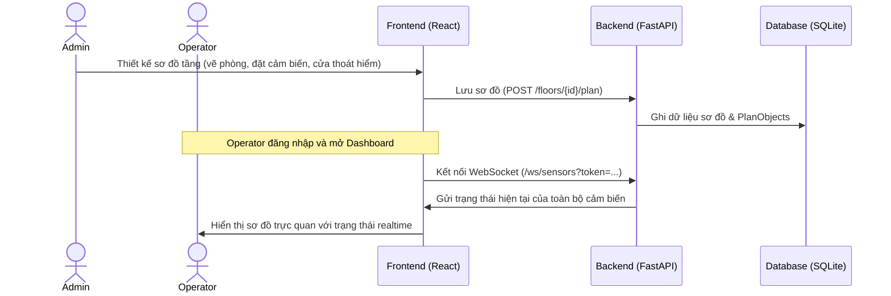
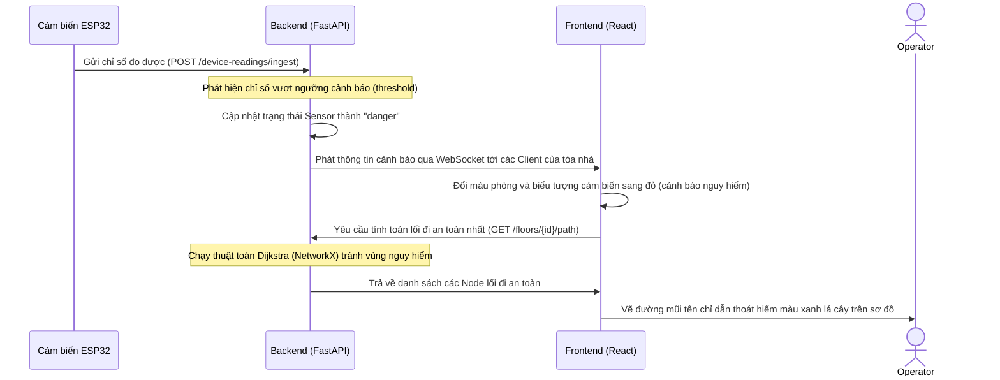

# Phân Tích Nghiệp Vụ Hệ Thống Giám Sát An Toàn Tòa Nhà (Emberpath)

Hệ thống **Emberpath** là một giải pháp giám sát an toàn tòa nhà thông minh, tích hợp giữa phần cứng IoT (ESP32), máy chủ xử lý dữ liệu tập trung (FastAPI) và bảng điều khiển trực quan (React). Dưới đây là bảng phân tích nghiệp vụ chi tiết của hệ thống hiện tại:

---

## 1. Bảng Phân Tích Chi Tiết Các Chức Năng (Functional Analysis)

| Nhóm nghiệp vụ | Tên chức năng | Đối tượng sử dụng | Mô tả chức năng | Quy trình / Logic nghiệp vụ |
| :--- | :--- | :--- | :--- | :--- |
| **1. Quản lý Tài khoản & Phân quyền** | **Đăng ký / Đăng nhập** | Tất cả người dùng | Xác thực thông tin người dùng vào hệ thống. | Sử dụng chuẩn xác thực JWT. Khi đăng nhập thành công, token được lưu ở client để đính kèm vào header các request sau. |
| | **Đa tòa nhà (Multi-tenancy)** | Hệ thống | Tách biệt hoàn toàn dữ liệu giữa các tòa nhà khác nhau. | Tài khoản đăng nhập được liên kết trực tiếp với một `building_id`. Mọi truy vấn đọc/ghi dữ liệu sơ đồ, tầng, cảm biến đều được lọc theo `building_id` của user đó để bảo mật thông tin. |
| | **Phân quyền vai trò (RBAC)** | Hệ thống | Phân tách quyền hạn giữa Admin và Operator. | - **Admin Tòa nhà**: Được toàn quyền xem, sửa, xóa, thiết kế sơ đồ tầng và thiết bị. - **Operator**: Chỉ có quyền giám sát thời gian thực, xem sơ đồ và định tuyến lối thoát hiểm. |
| **2. Giám sát & Dashboard** | **Dashboard tổng quan** | Admin, Operator | Hiển thị các chỉ số thống kê và trạng thái hoạt động tức thời của tòa nhà. | Thống kê số lượng tầng, tổng số cảm biến hoạt động, số cảnh báo khói (MQ2) hoặc nhiệt độ cao đang xảy ra tại tòa nhà đó. |
| | **Luồng dữ liệu realtime** | Operator | Cập nhật tức thời dữ liệu cảm biến mà không cần tải lại trang. | Frontend thiết lập kết nối WebSocket với `/ws/sensors` truyền kèm token. Khi có dữ liệu mới từ cảm biến do ESP32 hoặc simulator bắn lên backend, backend sẽ phát (broadcast) tới toàn bộ các client đang kết nối của tòa nhà đó. |
| | **Bảng dữ liệu lịch sử** | Admin, Operator | Xem danh sách chi tiết các lần đọc cảm biến và tìm kiếm, lọc theo thiết bị hoặc tầng. | Hiển thị lịch sử các lần cảm biến đo được (giá trị, đơn vị, trạng thái an toàn/nguy hiểm, mốc thời gian nhận). |
| **3. Thiết kế Sơ đồ Tầng (Editor Canvas)** | **Quản lý Tầng (Floor CRUD)** | Admin | Tạo mới, đổi tên hoặc xóa các tầng trong tòa nhà. | Tạo tầng mới sẽ tự động khởi tạo một sơ đồ trống (`FloorPlan`) có phiên bản (versioning) tương ứng. |
| | **Vẽ sơ đồ tương tác** | Admin | Cho phép kéo thả vẽ sơ đồ kiến trúc và bố trí vật lý các thiết bị. | Sử dụng thư viện **React Konva** (canvas 2D). Hỗ trợ: - Vẽ phòng (room), cửa thoát hiểm (exit), nhãn văn bản (label). - Bố trí thiết bị cảm biến (sensor). - Liên kết các vị trí bằng đường nối (connector). - Thao tác nhanh: Duplicate (nhân bản), copy/paste, delete, zoom/pan và undo/redo. |
| | **Lưu trữ & Đồng bộ** | Admin | Lưu lại cấu hình sơ đồ thiết kế xuống cơ sở dữ liệu. | Sơ đồ được lưu dưới dạng chuỗi JSON cấu trúc canvas đồ họa kèm theo việc đồng bộ các đối tượng vật lý (`PlanObject`) vào cơ sở dữ liệu để phục vụ tìm kiếm/định tuyến. |
| **4. Định tuyến & Thoát hiểm thông minh** | **Tìm lối đi an toàn** | Operator, Hệ thống | Tự động tính toán đường đi tối ưu tránh các khu vực nguy hiểm. | Sử dụng thuật toán Dijkstra qua thư viện **NetworkX**: - Hệ thống duyệt các phòng chứa cảm biến đang có trạng thái `danger` (nguy hiểm). - Gán mức phạt trọng số (penalty) cực kỳ lớn cho các cạnh đi qua các phòng nguy hiểm đó. - Tìm đường ngắn nhất từ vị trí hiện tại đến cửa thoát hiểm gần nhất mà không đi qua các phòng nguy hiểm (trừ khi điểm xuất phát nằm sẵn trong vùng đó). |
| **5. Kết nối Thiết bị (IoT Integration)** | **Ingest Data API** | ESP32, Simulator | Cổng tiếp nhận dữ liệu từ các thiết bị ngoại vi hoặc phần mềm mô phỏng. | Endpoint `POST /device-readings/ingest` nhận dữ liệu đo đạc (nhiệt độ/khói). Nếu giá trị vượt ngưỡng (`threshold`) quy định của cảm biến, hệ thống tự động đổi trạng thái thiết bị sang `danger` và kích hoạt cảnh báo realtime. |

---

## 2. Luồng Nghiệp Vụ Chính (Key Workflows)

### Luồng 1: Thiết lập & Giám sát (Admin & Operator)

### Luồng 2: Cảnh báo & Định tuyến thoát hiểm khi xảy ra Sự cố (Realtime Alert & Pathfinding)

